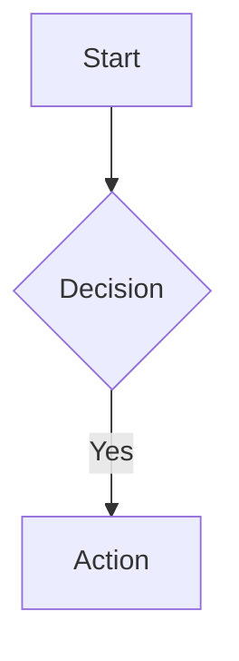

# Mermaid Alignment Context

## Purpose

This document provides context for aligning the floorplan project structure with Mermaid.js conventions, based on analysis of [PR #4839](https://github.com/mermaid-js/mermaid/pull/4839) (Packet Diagram).

## Current State (Dec 2024)

### Project Structure

```
mermaid-floorplan/
├── language/                        # floorplans-language package
│   ├── src/
│   │   ├── diagrams/floorplans/     # ← Diagram folder (grammar + rendering)
│   │   │   ├── floorplans.langium   # Langium grammar
│   │   │   ├── renderer.ts          # Main renderer (render, renderFloor, renderToFile)
│   │   │   ├── styles.ts            # Theming (getStyles, darkTheme, blueprintTheme)
│   │   │   ├── floor.ts             # calculateFloorBounds, generateFloorRectangle
│   │   │   ├── room.ts              # generateRoomSvg, generateRoomText
│   │   │   ├── wall.ts              # wallRectangle
│   │   │   ├── door.ts              # generateDoor
│   │   │   ├── window.ts            # generateWindow
│   │   │   └── index.ts             # Re-exports all
│   │   │
│   │   ├── generated/               # Langium-generated from grammar
│   │   │   ├── ast.ts               # AST types (Floorplan, Floor, Room, etc.)
│   │   │   ├── grammar.ts           # Grammar definition
│   │   │   └── module.ts            # Generated services
│   │   │
│   │   ├── floorplans-module.ts     # Langium service module
│   │   ├── floorplans-validator.ts  # Custom validation rules
│   │   └── index.ts                 # Package exports
│   │
│   ├── langium-config.json          # Points to diagrams/floorplans/floorplans.langium
│   └── package.json                 # "floorplans-language"
│
├── mcp-server/                      # MCP server package
│   ├── src/
│   │   ├── tools/
│   │   │   ├── render.ts            # render_floorplan (PNG/SVG)
│   │   │   ├── validate.ts          # validate_floorplan
│   │   │   └── modify.ts            # modify_floorplan
│   │   └── utils/
│   │       ├── parser.ts            # Uses floorplans-language
│   │       └── renderer.ts          # Imports from floorplans-language, adds svgToPng
│   └── package.json                 # "floorplans-mcp-server"
│
├── src/                             # Main web app
│   ├── app.ts                       # Monaco editor setup
│   ├── editor.ts                    # Editor logic
│   └── renderer.ts                  # Imports render from floorplans-language
│
└── scripts/
    └── generate-svg.ts              # CLI for generating SVG files
```

### Code Reuse Flow

All consumers import from `floorplans-language`:

```typescript
// Main app (src/renderer.ts)
import { render } from "floorplans-language";

// MCP server (mcp-server/src/utils/renderer.ts)
import { render } from "floorplans-language";

// CLI script (scripts/generate-svg.ts)
import { renderToFile } from "floorplans-language";
```

## Mermaid PR #4839 Structure (Reference)

```
packages/
├── parser/                          # @mermaid-js/parser (Langium grammars)
│   ├── src/language/packet/
│   │   ├── packet.langium           # Grammar
│   │   ├── module.ts                # Langium services
│   │   ├── tokenBuilder.ts          # Token customization
│   │   └── index.ts
│   └── langium-config.json
│
└── mermaid/                         # @mermaid-js/mermaid (main package)
    └── src/diagrams/packet/
        ├── diagram.ts               # Entry: { parser, db, renderer, styles }
        ├── parser.ts                # Wrapper: import { parse } from '@mermaid-js/parser'
        ├── db.ts                    # State management (pushWord, getPacket, clear)
        ├── detector.ts              # Diagram type detection
        ├── renderer.ts              # SVG rendering with D3
        ├── styles.ts                # CSS theming
        └── types.ts                 # TypeScript interfaces
```

## Key Differences

| Aspect | Mermaid | Current Project |
|--------|---------|-----------------|
| Package structure | Monorepo (parser + mermaid) | Single language package |
| Grammar location | `packages/parser/src/language/{type}/` | `language/src/diagrams/floorplans/` |
| Parser integration | Separate package, imported via `@mermaid-js/parser` | Directly uses Langium in same package |
| Diagram DB | Explicit `db.ts` with state management | State in Langium document |
| Detector | `detector.ts` for type detection | Not needed (standalone) |
| Rendering | D3-based in browser | String-based SVG generation |

## What We Have vs Mermaid Convention

### ✅ Aligned

1. **Diagram folder structure** - `diagrams/floorplans/` contains rendering logic
2. **styles.ts** - `getStyles()` function for theming, theme presets
3. **renderer.ts** - Main rendering entry point
4. **Component separation** - floor, room, wall, door, window modules

### ⚠️ Different (but appropriate for standalone)

1. **No separate parser package** - Grammar is in same package as renderer
2. **No db.ts** - Using Langium's document model directly
3. **No detector.ts** - Not needed for standalone extension
4. **No diagram.ts entry** - Using index.ts for exports
5. **String-based SVG** - Not D3-based (works for MCP server PNG conversion)

## Files to Reference

### Key Language Package Files

- `language/src/diagrams/floorplans/index.ts` - Main exports
- `language/src/diagrams/floorplans/renderer.ts` - Render functions
- `language/src/diagrams/floorplans/styles.ts` - Theme system
- `language/src/index.ts` - Package entry point

### Consumer Files

- `src/renderer.ts` - Web app usage
- `mcp-server/src/utils/renderer.ts` - MCP server usage (adds PNG conversion)
- `scripts/generate-svg.ts` - CLI usage

### Configuration

- `language/langium-config.json` - Grammar location config
- `language/package.json` - Package exports

## If Converting to Mermaid Monorepo Style

To fully align with Mermaid's structure, you would:

1. **Create separate parser package**:
   ```
   packages/parser/src/language/floorplans/
   ├── floorplans.langium
   ├── module.ts
   ├── tokenBuilder.ts
   └── index.ts
   ```

2. **Move rendering to mermaid package**:
   ```
   packages/mermaid/src/diagrams/floorplans/
   ├── diagram.ts       # { parser, db, renderer, styles }
   ├── parser.ts        # Wrapper for @mermaid-js/parser
   ├── db.ts            # State management
   ├── detector.ts      # Type detection
   ├── renderer.ts      # D3-based rendering
   ├── styles.ts        # Theming
   └── types.ts
   ```

3. **Add db.ts for state management**:
   ```typescript
   // db.ts
   export interface FloorplanDB extends DiagramDBBase<FloorplanConfig> {
     getFloors: () => Floor[];
     getRooms: () => Room[];
     clear: () => void;
   }
   ```

4. **Convert renderer to D3**:
   ```typescript
   // renderer.ts
   import * as d3 from 'd3';
   import { selectSvgElement } from '../../rendering-util/selectSvgElement.js';
   
   export const draw: DrawDefinition = (_text, id, _version, diagram) => {
     const db = diagram.db as FloorplanDB;
     const svg = selectSvgElement(id);
     // D3-based rendering...
   };
   ```

## Current Exports from floorplans-language

```typescript
// From language/src/index.ts
export * from "./floorplans-module.js";     // createFloorplansServices
export * from "./floorplans-validator.js";  // Validator
export * from "./generated/ast.js";         // Floorplan, Floor, Room, etc.
export * from "./generated/grammar.js";     // Grammar
export * from "./generated/module.js";      // Generated module
export * from "./diagrams/floorplans/index.js"; // render, renderFloor, renderToFile, getStyles, themes
export { monarchConfig };                   // Syntax highlighting
```

## Testing

```bash
# Run language tests
npm run test

# Generate SVGs from DSL
npx tsx scripts/generate-svg.ts TriplexVilla.floorplan

# Build all packages
npm run build --workspaces

# Test MCP server
# Use render_floorplan tool with format: "svg" or "png"
```

## Decision Log

1. **Single package vs monorepo**: Chose single package for simplicity as standalone extension
2. **String-based SVG vs D3**: String-based is **optimal** for floorplans (see below)
3. **Grammar in diagram folder**: Following Mermaid's "diagram folder" concept while keeping grammar co-located
4. **No detector.ts**: Not needed for standalone - would be added if contributing upstream

## Key Insight: Why Mermaid Uses D3 (And Why We Don't Need It)

### The Real Reason Mermaid Uses D3

Mermaid's D3 dependency exists primarily for **automatic graph layout algorithms**, not just SVG rendering:



In this flowchart, the user specifies **relationships** (A→B→C), but NOT positions. Mermaid uses:
- **[Dagre](https://github.com/dagrejs/dagre)** / **ELK** - Graph layout algorithms
- **D3** - DOM manipulation to render at calculated positions

These layout algorithms solve:
- Where each node should be placed
- How to route edges without overlapping
- How to minimize edge crossings

### Why Floorplans Don't Need D3

Floorplans are **coordinate-based**, not **relationship-based**:

```
room Office at (0,0) size (10 x 12) walls [...]
room Kitchen at (0,14) size (10 x 8) walls [...]
```

| Diagram Type | User Provides | Layout Problem | D3/Dagre Benefit |
|--------------|---------------|----------------|------------------|
| Flowchart | Relationships (A→B) | Where do nodes go? | ✅ Essential |
| Sequence | Participants + messages | Time-based ordering | ✅ Helpful |
| **Floorplan** | Exact positions `at (x,y)` | **None** | ❌ No benefit |

**Conclusion:** String-based SVG rendering is the **optimal choice** for floorplans, not a compromise. The core algorithmic value of D3 (layout) doesn't apply to coordinate-based diagrams.

### Upstream Contribution Note

If contributing to Mermaid core, a thin D3 wrapper would be needed for `mermaid.render()` API compatibility, but:
- The wrapper would be ~50 lines (just DOM manipulation)
- No layout algorithms needed
- Core geometry logic remains string-based

