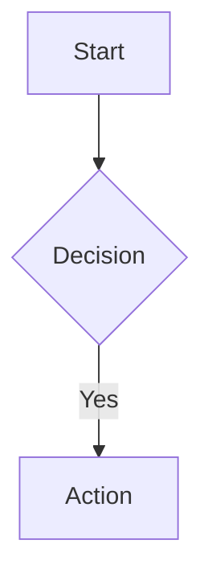

# Standalone Phase Roadmap

This document tracks future improvements for the standalone floorplan project, to be implemented after the current `add-rendering-parity` change is complete.

## Priority 2: Rendering Improvements

### 2.1 Room Type Visual Distinction
**Status:** Backlog  
**Grammar:** `type=('room' | 'sub-room')` exists but not visually distinct  
**Scope:** Modify `room.ts`, `styles.ts`

**Tasks:**
- Add `.sub-room` CSS class with distinct styling
- Consider lighter fill or dashed border for sub-rooms
- Update theme options to include sub-room colors

### 2.2 Door Positioning on Walls
**Status:** Backlog  
**Scope:** Enhance individual wall door positioning

**Tasks:**
- Allow door position specification directly on `walls [bottom: door]`
- Support offset from wall edge (e.g., `bottom: door@30%`)

### 2.3 Theme Expansion
**Status:** Backlog  
**Current:** 3 themes (default, dark, blueprint)

**New themes to add:**
- `architectTheme` - hand-drawn/sketch style with rougher lines
- `minimalTheme` - black/white, clean lines, no fills
- `printTheme` - optimized for printing (high contrast, no backgrounds)

**Tasks:**
- Add new theme presets to `styles.ts`
- Consider custom theme builder API
- Document theme customization in README

---

## Priority 3: DSL Enhancements

### 3.1 Room Annotations
**Status:** Backlog  
**Scope:** Grammar + rendering additions

**Proposed syntax:**
```
room Office at (0,0) size (10 x 12) walls [...] 
  note "Fire exit here"
```

**Tasks:**
- Add `note` to grammar
- Render as callout box near room
- Support positioning (`note "text" at top-right`)

### 3.2 Furniture Placement (Future)
**Status:** Future consideration  
**Scope:** Major grammar + rendering addition

**Proposed syntax:**
```
room Office at (0,0) size (10 x 12) walls [...]
  furniture [
    desk at (2,3) size (2 x 1)
    chair at (4,3)
  ]
```

**Consideration:** May be out of scope for MVP - evaluate after core features stable

### 3.3 Dimension Units
**Status:** Backlog  
**Scope:** Grammar modification + display

**Proposed syntax:**
```
room Office at (0,0) size (10m x 12m) walls [...]
# or
room Office at (0,0) size (10ft x 12ft) walls [...]
```

**Tasks:**
- Add optional unit suffix to grammar
- Display unit in room size label
- Add scale indicator to SVG output (e.g., "1 unit = 1 meter")

### 3.4 Area Calculation
**Status:** Backlog  
**Scope:** Rendering enhancement

**Tasks:**
- Auto-calculate room area from dimensions
- Display area in room (e.g., "120 sq ft")
- Add total floor area summary (optional text element)

---

## Priority 4: Testing & Quality

### 4.1 MCP Server Integration Tests
**Status:** Backlog (marked deferred in `add-mcp-server/tasks.md`)  
**Location:** `mcp-server/test/`

**Tests needed:**
- `render_floorplan` with various DSL inputs
- `modify_floorplan` all operations (add, remove, resize, move, rename, update_walls, add_label)
- Error handling for malformed DSL
- Edge cases (empty floorplan, single room, deeply nested sub-rooms)

### 4.2 Visual Regression Tests
**Status:** Backlog  
**Scope:** Snapshot testing for SVG output

**Tasks:**
- Set up snapshot testing framework (e.g., jest-image-snapshot or vitest equivalent)
- Create baseline SVG snapshots for standard floorplans
- Run comparisons on CI to detect unintended rendering changes

### 4.3 Parser Edge Case Tests
**Status:** Backlog  
**Location:** `language/test/`

**Test cases:**
- Deeply nested sub-rooms (3+ levels)
- Rooms at negative coordinates
- Very large floorplans (100+ rooms)
- Unicode characters in room names and labels
- Maximum dimension values

---

## Priority 5: Documentation & Specifications

### 5.1 Create OpenSpec Specifications
**Status:** Backlog  
**Note:** `openspec/specs/` is currently empty

**Specs to create:**
- `specs/dsl-grammar/spec.md` - Grammar specification and syntax rules
- `specs/rendering/spec.md` - SVG rendering behavior and requirements
- `specs/mcp-server/spec.md` - MCP tool specifications and schemas

### 5.2 README Enhancements
**Status:** Backlog

**Sections to add/update:**
- Visual examples of all wall types (solid, door, window, open)
- Connection syntax examples with rendered output
- Theme customization guide
- MCP server configuration for various AI tools

---

## D3-Based Renderer Analysis (Upstream Contribution)

### Status: **NOT RECOMMENDED - String-Based is Optimal for Floorplans**

### Research Summary (Dec 2024)

The question of converting from string-based SVG rendering to D3-based rendering was researched for Mermaid compliance.

**Key Finding:** D3 is used by Mermaid primarily for **automatic graph layout algorithms** (dagre, ELK), not just SVG rendering. Floorplans don't need this because users explicitly specify coordinates.

### Why Mermaid Uses D3: The Real Reason

Mermaid's D3 dependency exists primarily because of **automatic node positioning**:



In this flowchart, the user specifies **relationships** (A→B→C), but NOT positions. Mermaid uses:
1. **[Dagre](https://github.com/dagrejs/dagre)** / **ELK** - Graph layout algorithms (Sugiyama algorithm)
2. **D3** - DOM manipulation to render at calculated positions

These algorithms solve:
- Where each node should be placed
- How to route edges without overlapping
- How to minimize edge crossings
- Hierarchical layer assignment

### Why Floorplans Are Fundamentally Different

Floorplan DSL is **coordinate-based**, not **relationship-based**:

```
room Office at (0,0) size (10 x 12) walls [...]
room Kitchen at (0,14) size (10 x 8) walls [...]
```

| Aspect | Flowchart/Sequence Diagram | Floorplan |
|--------|---------------------------|-----------|
| User provides | Relationships (A→B) | Exact positions `at (x,y)` |
| Layout problem | Where do nodes go? | None - user specified |
| Algorithm needed | Dagre/ELK | None |
| D3 benefit | Enables layout engines | No benefit |

**There's no "figure out where things go" problem to solve.**

### Comparison: String-Based vs D3

| Factor | String-Based | D3-Based |
|--------|-------------|----------|
| **Layout algorithms** | N/A (not needed) | N/A (not needed) |
| **MCP Server** | ✅ Direct resvg-js PNG | ⚠️ Needs Puppeteer (~200MB) |
| **Server-side** | ✅ Pure Node.js | ⚠️ JSDOM dependency |
| **Bundle size** | ✅ ~10MB | ⚠️ +100KB for D3 |
| **Performance** | ✅ Fast string concat | ⚠️ DOM overhead |
| **Code complexity** | ✅ Simple, functional | ⚠️ Imperative, side-effects |

### mermaid-cli Precedent

Even Mermaid's official CLI ([mermaid-cli](https://github.com/mermaid-js/mermaid-cli)) uses **Puppeteer headless browser** for server-side rendering, not D3+JSDOM. This confirms that D3's browser dependency is a known limitation.

### If Upstream Contribution Becomes a Priority

For Mermaid API compatibility (`mermaid.render(id, text)`), a thin D3 wrapper would be needed:

```
language/src/diagrams/floorplans/
├── core/           # Shared geometry calculations (unchanged)
│   ├── floor.ts
│   ├── room.ts
│   └── door.ts
├── renderers/
│   ├── string.ts   # MCP server, standalone (current)
│   └── d3.ts       # Mermaid API wrapper (thin layer)
└── index.ts
```

The D3 renderer would be a **thin wrapper** that:
1. Calls the same geometry functions
2. Uses D3 selection API to append to existing DOM element
3. Required only for `mermaid.render()` compatibility

**Important:** The D3 renderer wouldn't use dagre/ELK because floorplans have explicit coordinates. It's purely for API compatibility, not algorithmic benefit.

### Effort Estimate (If Ever Needed)

| Task | Effort |
|------|--------|
| Create D3 wrapper for Mermaid API | 4-6 hours |
| Testing in Mermaid context | 2-4 hours |
| **Total** | **~6-10 hours** |

Note: Much simpler than initially estimated because we don't need layout algorithms.

### Final Decision

**String-based rendering is the optimal choice for floorplans**, not just a temporary solution:

1. ✅ **No layout algorithm needed** - Positions are explicit in DSL
2. ✅ **MCP server optimized** - Lightweight PNG generation  
3. ✅ **Better performance** - No DOM overhead
4. ✅ **Simpler code** - Pure functions, no side effects
5. ✅ **Smaller bundle** - No D3 dependency

If contributing upstream to Mermaid, add a thin D3 wrapper for API compatibility only. The core rendering logic remains string-based and is the correct architectural choice for coordinate-based diagrams like floorplans.

---

## Future Consideration: Constraint-Based Layout (Auto-Positioning)

### Status: **RESEARCH COMPLETE - Not Recommended for DSL Approach**

### Research Summary (Dec 2024)

Investigated whether floorplans could use **relationship-based positioning** (like Mermaid flowcharts) instead of explicit coordinates.

**Proposed DSL Example:**
```
room Kitchen size (10 x 8) walls [...]
room LivingRoom size (15 x 12) walls [...] adjacent-to Kitchen.right
room Bedroom size (12 x 10) walls [...] adjacent-to LivingRoom.top
```

### The Fundamental Problem: Rectangle Packing is NP-Hard

Unlike graph layout (dagre), floorplan layout is a **constrained optimization problem**:

| Graph Layout (dagre) | Floorplan Layout |
|---------------------|------------------|
| Node sizes flexible | Room sizes **fixed** |
| Minimize edge crossings | Rooms must be **adjacent on specific walls** |
| Aesthetic preferences | **Zero overlap** required |
| Many valid solutions | Often **no solution exists** |

**2D Rectangle Packing is NP-hard** - there's no efficient algorithm that always finds a valid arrangement. This is why architectural CAD software uses manual placement, not auto-layout.

### Approaches Researched

#### 1. Treemap Algorithms (d3-treemap)

**What it does:** Hierarchical rectangle subdivision based on data values.

**Why it doesn't work for floorplans:**
- Sizes are proportional to values, not exact dimensions
- No adjacency control (Kitchen must be next to Dining Room)
- Designed for visualization, not architectural constraints
- Squarified algorithm optimizes aspect ratio, ignores room relationships

#### 2. Constraint Solvers (Cassowary/Kiwi.js)

**What it does:** Solves systems of linear constraints (used in CSS layout, iOS Auto Layout).

**Why it's limited for floorplans:**
- Works well for 1D (horizontal OR vertical), harder for 2D
- Can't easily express "adjacent on right wall" + "sizes are fixed"
- No built-in optimization for space efficiency
- May have no solution for overconstrained problems

#### 3. VLSI Floorplanning Algorithms

**What it does:** Places circuit modules on chips with area constraints.

**Why it's not directly applicable:**
- Optimizes for wire length and area, not architectural adjacency
- Usually allows flexible aspect ratios
- Complex algorithms (simulated annealing, genetic algorithms)
- Heavy computational requirements

#### 4. AI/ML Approaches (HouseDiffusion, ActFloor-GAN)

**What they do:** Generate floorplans from scratch using deep learning.

**Why they're overkill for DSL layout:**
- Designed for generative design (creating new layouts)
- Require training data (thousands of floorplans)
- Non-deterministic outputs
- Can't guarantee exact dimensions

### Why Explicit Coordinates Are Actually Better for Floorplans

| Factor | Constraint-Based | Explicit Coordinates |
|--------|-----------------|---------------------|
| **Determinism** | May fail or vary | Always works |
| **Precision** | Approximate | Exact placement |
| **User intent** | Inferred | Explicit |
| **Debugging** | "Why is it there?" | Obvious |
| **Complexity** | NP-hard solver | Simple arithmetic |
| **AI assistance** | Hard to explain constraints | Easy: "move to (x,y)" |

### The MCP Server Advantage

With the current explicit coordinate approach + MCP server:

1. **AI can "see" the layout** via PNG rendering
2. **AI can suggest changes** using `modify_floorplan` tool
3. **AI reasons spatially** - "Kitchen is at (0,14), I should place Pantry at (10,14)"
4. **Humans remain in control** - Final positions are explicit and editable

This is **more practical** than trying to make AI understand complex constraint systems.

### Hybrid Approach: Helpers, Not Auto-Layout

Instead of full auto-layout, consider **helper functions** for common patterns:

```typescript
// Possible future DSL enhancement
room Kitchen size (10 x 8)
room Pantry size (4 x 6) snap-to Kitchen.right  // Helper: places at (10, 14)
```

This would:
- Calculate `at (x, y)` automatically for simple cases
- Expand to explicit coordinates in the AST
- Fail clearly if overlap detected
- Keep explicit coordinates as the source of truth

### Recommendation

**Keep explicit coordinates as the primary positioning mechanism.** The current approach is:

1. ✅ **Deterministic** - Same input always produces same output
2. ✅ **AI-friendly** - MCP tools can read/write coordinates
3. ✅ **User-controllable** - No "magic" placement
4. ✅ **Architecturally accurate** - Real floorplans need exact positions

**Future enhancement:** Add optional convenience helpers (`snap-to`, `align-with`) that expand to explicit coordinates, not a full constraint solver

---

## Completed Items

Items move here after implementation:

- *(none yet)*

---

## Change Proposal Mapping

When ready to implement these items, create change proposals:

| Backlog Item | Suggested Change ID |
|--------------|---------------------|
| Room Type Visual Distinction | `add-subroom-styling` |
| Theme Expansion | `add-themes` |
| Room Annotations | `add-room-annotations` |
| Dimension Units | `add-dimension-units` |
| Area Calculation | `add-area-calculation` |
| MCP Integration Tests | `add-mcp-tests` |
| Visual Regression Tests | `add-visual-tests` |
| OpenSpec Specifications | `add-core-specs` |

---

*Last updated: December 2024*

