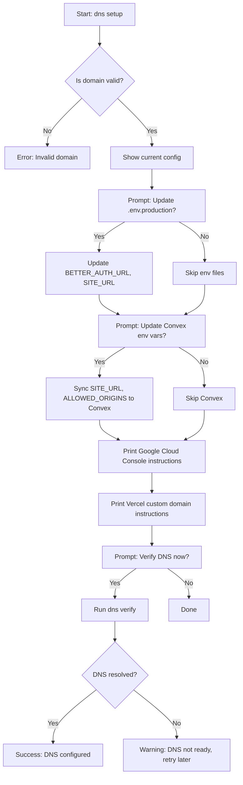

# Admin CLI Tool — Implementation Plan

## Overview

A local CLI tool for `floorplan-app` administrators to manage deployment configuration, DNS settings, environment variables, and platform administration tasks. Built with [Commander.js](https://github.com/tj/commander.js) and interactive prompts.

## Goals

1. **Configuration Management**: Set production domain, super admin email, OAuth credentials, Convex URLs, auth secrets
2. **Environment Synchronization**: Keep `.env.production`, `.env.development`, and Convex cloud env vars in sync
3. **DNS Setup Wizard**: Interactive workflow for custom domain configuration
4. **Admin Operations**: Promote/demote admins, ban/unban users, feature projects, view stats
5. **Validation & Verification**: Pre-deploy checks, post-deploy verification, config consistency

---

## Architecture

```
scripts/admin-cli.ts          # Entry point (shebang + Commander setup)
scripts/admin-cli/
  ├── commands/
  │   ├── config.ts           # config set-domain, set-super-admin, show, validate
  │   ├── env.ts              # env update-production, sync-to-convex
  │   ├── dns.ts              # dns setup, verify
  │   ├── admin.ts            # admin promote, ban, list-users, stats
  │   └── deploy.ts           # deploy check, verify
  ├── lib/
  │   ├── env-file.ts         # Read/write .env files with comments preserved
  │   ├── convex-cli.ts       # Wrapper for `npx convex env set`
  │   ├── validators.ts       # URL, email, domain validation
  │   ├── prompts.ts          # Reusable inquirer prompts
  │   └── colors.ts           # Terminal output formatting
  └── types.ts                # Shared TypeScript types
```

---

## Command Reference

### `config` — Configuration Management

```bash
# Set production domain (updates all relevant files and env vars)
npx tsx scripts/admin-cli.ts config set-domain floorplan.whiteblossom.net

# Set super admin email
npx tsx scripts/admin-cli.ts config set-super-admin admin@whiteblossom.net

# Set Google OAuth credentials
npx tsx scripts/admin-cli.ts config set-google-oauth \
  <client-id>.apps.googleusercontent.com \
  GOCSPX-<secret>

# Set Convex cloud URLs
npx tsx scripts/admin-cli.ts config set-convex \
  https://happy-animal-123.convex.cloud \
  https://happy-animal-123.convex.site

# Generate or set Better Auth secret
npx tsx scripts/admin-cli.ts config set-auth-secret
npx tsx scripts/admin-cli.ts config set-auth-secret my-custom-secret

# Show current configuration
npx tsx scripts/admin-cli.ts config show

# Validate configuration consistency
npx tsx scripts/admin-cli.ts config validate
```

### `env` — Environment File Management

```bash
# Update .env.production template with current config
npx tsx scripts/admin-cli.ts env update-production

# Update .env.development (for local testing with custom domain)
npx tsx scripts/admin-cli.ts env update-local

# Sync all env vars to Convex cloud
npx tsx scripts/admin-cli.ts env sync-to-convex

# Sync specific vars only
npx tsx scripts/admin-cli.ts env sync-to-convex --vars SITE_URL,BETTER_AUTH_SECRET
```

### `dns` — DNS Setup Wizard

```bash
# Interactive DNS setup wizard
npx tsx scripts/admin-cli.ts dns setup floorplan.whiteblossom.net

# Verify DNS records are configured correctly
npx tsx scripts/admin-cli.ts dns verify floorplan.whiteblossom.net
```

### `admin` — Platform Administration

```bash
# List all users
npx tsx scripts/admin-cli.ts admin list-users

# Promote user to admin
npx tsx scripts/admin-cli.ts admin promote <user-id>

# Ban a user
npx tsx scripts/admin-cli.ts admin ban <user-id> --reason "spam" --duration 7d

# Show platform stats
npx tsx scripts/admin-cli.ts admin stats

# Feature a project
npx tsx scripts/admin-cli.ts admin feature <project-id>
```

### `deploy` — Deployment Verification

```bash
# Pre-deploy checklist
npx tsx scripts/admin-cli.ts deploy check

# Post-deploy verification
npx tsx scripts/admin-cli.ts deploy verify
```

---

## Files That Must Be Updated

### 1. `.env.production` (template)

| Variable | Set By | Example |
|---|---|---|
| `VITE_CONVEX_URL` | `config set-convex` | `https://xxx.convex.cloud` |
| `CONVEX_DEPLOYMENT` | `config set-convex` | `prod:xxx` |
| `BETTER_AUTH_SECRET` | `config set-auth-secret` | `openssl rand -base64 32` |
| `BETTER_AUTH_URL` | `config set-domain` | `https://floorplan.whiteblossom.net` |
| `SITE_URL` | `config set-domain` | `https://floorplan.whiteblossom.net` |
| `VITE_CONVEX_SITE_URL` | `config set-convex` | `https://xxx.convex.site` |
| `GOOGLE_CLIENT_ID` | `config set-google-oauth` | `xxx.apps.googleusercontent.com` |
| `GOOGLE_CLIENT_SECRET` | `config set-google-oauth` | `GOCSPX-xxx` |
| `DEV_AUTH_BYPASS` | hardcoded | `false` |
| `VITE_MOCK_MODE` | hardcoded | `false` |
| `NODE_ENV` | hardcoded | `production` |
| `SUPER_ADMIN_EMAIL` | `config set-super-admin` | `admin@whiteblossom.net` |

### 2. `.env.development` (optional local override)

When testing the custom domain locally, update:
- `BETTER_AUTH_URL`
- `SITE_URL`
- `VITE_CONVEX_SITE_URL`

### 3. Convex Cloud Environment Variables

| Variable | Set By | Source |
|---|---|---|
| `SITE_URL` | `env sync-to-convex` | `BETTER_AUTH_URL` from `.env.production` |
| `CONVEX_SITE_URL` | `env sync-to-convex` | `VITE_CONVEX_SITE_URL` from `.env.production` |
| `BETTER_AUTH_SECRET` | `env sync-to-convex` | Must match Vercel value |
| `GOOGLE_CLIENT_ID` | `env sync-to-convex` | From `.env.production` |
| `GOOGLE_CLIENT_SECRET` | `env sync-to-convex` | From `.env.production` |
| `SUPER_ADMIN_EMAIL` | `env sync-to-convex` | From `.env.production` |
| `ALLOWED_ORIGINS` | `env sync-to-convex` | Derived from domain |

### 4. Google Cloud Console (manual, guided by CLI)

The CLI prints instructions for:
- Authorized JavaScript origins: `https://<domain>`
- Authorized redirect URIs: `https://<domain>/api/auth/callback/google`

### 5. Vercel Dashboard (manual, guided by CLI)

The CLI prints instructions for:
- Custom domain configuration
- Environment variable verification

---

## Implementation Details

### Env File Parser (`lib/env-file.ts`)

Must preserve comments and formatting while updating values:

```typescript
interface EnvFile {
  path: string;
  entries: Array<{ key: string; value: string; comment?: string; raw: string }>;
}

function readEnvFile(path: string): EnvFile;
function setEnvValue(file: EnvFile, key: string, value: string): void;
function writeEnvFile(file: EnvFile): void;
```

### Convex CLI Wrapper (`lib/convex-cli.ts`)

```typescript
async function convexEnvSet(key: string, value: string, options?: {
  url?: string;        // --url flag for self-hosted
  adminKey?: string;   // --admin-key flag
}): Promise<void>;

async function convexEnvList(options?: { url?: string }): Promise<Record<string, string>>;
```

### Validation (`lib/validators.ts`)

```typescript
function isValidDomain(domain: string): boolean;
function isValidEmail(email: string): boolean;
function isValidUrl(url: string, protocols?: string[]): boolean;
function isValidGoogleClientId(id: string): boolean;
function isValidConvexUrl(url: string): boolean;
```

### Interactive Prompts (`lib/prompts.ts`)

Using `inquirer` or `@inquirer/prompts`:

```typescript
async function promptDomain(): Promise<string>;
async function promptEmail(): Promise<string>;
async function promptConfirm(message: string): Promise<boolean>;
async function promptSelect<T>(message: string, choices: { name: string; value: T }[]): Promise<T>;
```

---

## DNS Setup Wizard Flow



---

## Validation Rules

### `config validate`

1. **Domain Consistency**: `BETTER_AUTH_URL`, `SITE_URL`, `VITE_BETTER_AUTH_URL` must share the same domain
2. **Secret Strength**: `BETTER_AUTH_SECRET` must be >= 32 characters
3. **URL Protocols**: Production URLs must use `https://`
4. **Convex URLs**: `VITE_CONVEX_URL` must end with `.convex.cloud`, `VITE_CONVEX_SITE_URL` with `.convex.site`
5. **Google OAuth**: `GOOGLE_CLIENT_ID` must end with `.apps.googleusercontent.com`
6. **Super Admin**: `SUPER_ADMIN_EMAIL` must be a valid email
7. **Local Dev Safety**: `DEV_AUTH_BYPASS` and `VITE_MOCK_MODE` must be `false` in `.env.production`

### `deploy check`

1. All required env vars are set in `.env.production`
2. `BETTER_AUTH_SECRET` is not the dev placeholder
3. Google OAuth credentials are present
4. Convex URLs are configured
5. Domain is set and valid
6. No `localhost` references in production config

### `deploy verify`

1. App responds at configured domain
2. Convex connection works
3. OAuth callback URL is accessible
4. Admin panel loads
5. SSL certificate is valid (for HTTPS)

---

## Dependencies

Add to root `package.json` devDependencies:

```json
{
  "commander": "^12.0.0",
  "inquirer": "^9.2.0",
  "chalk": "^5.3.0",
  "node-fetch": "^3.3.0",
  "dns2": "^2.1.0"
}
```

Or use `@inquirer/prompts` for modern ESM-compatible prompts.

---

## Security Considerations

1. **Never commit secrets**: The CLI reads/writes `.env.local` and `.env.production` but must never log secrets
2. **Local-only admin ops**: Admin mutations via CLI must check `NODE_ENV !== 'production'` or use a local-only API key
3. **Confirm destructive actions**: `env sync-to-convex` and `config set-*` commands require `--yes` flag or interactive confirmation
4. **Backup before mutate**: The CLI creates `.env.production.bak` before modifying

---

## mise Integration

Add to root `mise.toml`:

```toml
[tasks.admin-cli]
description = "Run admin CLI (pass args via ADMIN_ARGS)"
run = "npx tsx scripts/admin-cli.ts $ADMIN_ARGS"

[tasks.admin-config]
description = "Show current configuration"
run = "npx tsx scripts/admin-cli.ts config show"

[tasks.admin-setup-domain]
description = "Interactive domain setup (DOMAIN=floorplan.example.com)"
run = "npx tsx scripts/admin-cli.ts dns setup $DOMAIN"

[tasks.admin-sync-env]
description = "Sync env vars to Convex"
run = "npx tsx scripts/admin-cli.ts env sync-to-convex"

[tasks.admin-deploy-check]
description = "Pre-deploy checklist"
run = "npx tsx scripts/admin-cli.ts deploy check"
```

---

## Implementation Order

1. **Phase 1**: Core infrastructure
   - `lib/env-file.ts` — read/write .env with comment preservation
   - `lib/validators.ts` — validation functions
   - `lib/colors.ts` — terminal formatting

2. **Phase 2**: Config commands
   - `commands/config.ts` — set-domain, set-super-admin, show, validate
   - `commands/env.ts` — update-production, sync-to-convex

3. **Phase 3**: DNS wizard
   - `commands/dns.ts` — setup, verify
   - `lib/prompts.ts` — interactive prompts

4. **Phase 4**: Admin operations
   - `commands/admin.ts` — promote, ban, list-users, stats
   - `lib/convex-cli.ts` — wrapper for npx convex

5. **Phase 5**: Deploy verification
   - `commands/deploy.ts` — check, verify

6. **Phase 6**: Polish
   - Makefile targets
   - README documentation
   - Error handling and edge cases
