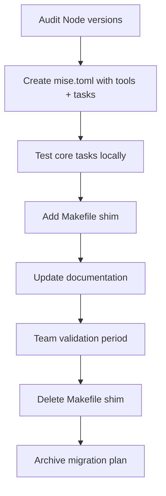

# Makefile → mise Migration Plan

## Objective
Replace the project Makefile with [mise](https://github.com/jdx/mise) tasks, unify tool version management under mise, and remove the legacy `.tool-versions`, `.nvmrc`, and Volta configuration.

## Current State

| File | Purpose | Current Value |
|------|---------|---------------|
| `Makefile` | Task runner | 50+ targets across build, export, Docker, admin |
| `.tool-versions` | asdf tool versions | `node 22.17.0` |
| `.nvmrc` | nvm version | `20` |
| `package.json#volta` | Volta pin | `node 20.19.2`, `npm 10.8.2` |

**Problem**: Three different Node version sources with conflicting values (22 vs 20).

## Target State

| File | Purpose |
|------|---------|
| `mise.toml` | Single source of truth for tools + tasks |
| `package.json` | npm scripts preserved for CI compatibility |
| `Makefile` | Compatibility shim during transition (deleted after validation) |

## 1. Tool Version Unification

**Decision**: Standardize on Node 22.17.0 (already in `.tool-versions`, LTS, newer than Volta’s 20.19.2).

- **Add to `mise.toml`**:
  ```toml
  [tools]
  node = "22.17.0"
  npm = "10.8.2"
  ```
- **Remove**: `.tool-versions`, `.nvmrc`, `package.json#volta`
- **Rationale**: mise handles both runtime and package manager versions. Node 22 is the active LTS and aligns with the existing `.tool-versions`.

## 2. Task Architecture in mise

mise tasks are defined in `[tasks.<name>]` tables with:
- `description` — shown in `mise tasks`
- `run` — shell script or command
- `depends` — task dependencies
- `dir` — working directory
- `env` — environment variables

### Task Group Mapping

```
[tasks]
# Core
core:install, core:build, core:clean, core:dev, core:test, core:langium, core:langium-watch

# Export & Rendering
export:images, export:svg, export:png, export:annotated, export:json, export:dxf

# 3D
3d:export, 3d:perspective

# Workspaces
ws:viewer-dev, ws:viewer-build, ws:editor-dev, ws:editor-build, ws:app-dev, ws:app-build, ws:app-start, ws:app-test, ws:mcp-build, ws:mcp-server

# Docker
docker:build, docker:up, docker:down, docker:logs, docker:shell, docker:clean, docker:dev, docker:restart, docker:reset-deps, docker:convex-deploy, docker:convex-backfill, docker:convex-admin-key

# Admin
admin:setup, admin:dev, admin:test, admin:reset, admin:help

# Utilities
util:rebuild, util:watch, util:setup-mock-auth
```

### Variable Handling

Makefile variables (`FLOORPLAN_FILE`, `SCALE`, etc.) become mise environment variables with defaults:

```toml
[env]
FLOORPLAN_FILE = "trial/TriplexVilla.floorplan"
OUTPUT_DIR = "trial"
SCALE = "15"
AREA_UNIT = "sqft"
LENGTH_UNIT = "ft"
PROJECTION = "isometric"
WIDTH_3D = "1200"
HEIGHT_3D = "900"
FOV = "50"
ADMIN_EMAIL = "admin@test.local"
```

Users override via: `FLOORPLAN_FILE=my.floorplan mise run export:images`

## 3. Detailed Task Definitions

### Core Tasks

| Task | Description | Implementation |
|------|-------------|----------------|
| `core:install` | Install all dependencies | `npm install` |
| `core:build` | Build all packages | `npm run build` (depends on `core:langium`) |
| `core:clean` | Clean build artifacts | `npm run clean && rm -f trial/*.svg trial/*.png` |
| `core:dev` | Start Vite dev server | `npm run dev` |
| `core:test` | Run tests | `npm run test` |
| `core:langium` | Generate Langium artifacts | `echo \| npm run langium:generate` |
| `core:langium-watch` | Watch Langium artifacts | `npm run langium:watch` |

### Export Tasks

| Task | Description | Implementation |
|------|-------------|----------------|
| `export:images` | SVG + PNG + 3D all floors | `tsx scripts/generate-images.ts … --all` + `tsx scripts/generate-3d-images.ts … --all` (both projections) |
| `export:svg` | SVG only | `tsx scripts/generate-images.ts … --all --svg-only` |
| `export:png` | PNG only | `tsx scripts/generate-images.ts … --all --png-only` |
| `export:annotated` | With all annotations | `tsx scripts/generate-images.ts … --all --show-area --show-dims --show-summary` |
| `export:json` | Export to JSON | `tsx scripts/export-json.ts $FLOORPLAN_FILE $OUTPUT_FILE` |
| `export:dxf` | Export to DXF | `tsx scripts/export-dxf.ts $FLOORPLAN_FILE $OUTPUT_DIR $DXF_FLAGS` |

### 3D Tasks

| Task | Description | Implementation |
|------|-------------|----------------|
| `3d:export` | 3D PNG isometric | `tsx scripts/generate-3d-images.ts … --all --projection isometric` |
| `3d:perspective` | 3D PNG perspective | `tsx scripts/generate-3d-images.ts … --all --projection perspective` |

### Workspace Tasks

| Task | Description | Implementation |
|------|-------------|----------------|
| `ws:viewer-dev` | 3D viewer dev server | `npm run --workspace floorplan-viewer dev` |
| `ws:viewer-build` | Build 3D viewer | `npm run --workspace floorplan-viewer build` |
| `ws:editor-dev` | Interactive editor dev | `npm run --workspace floorplan-editor dev` |
| `ws:editor-build` | Build editor | `npm run --workspace floorplan-editor build` |
| `ws:app-dev` | SolidStart app dev | `npm run --workspace floorplan-app dev` |
| `ws:app-build` | Build SolidStart app | `npm run --workspace floorplan-app build` |
| `ws:app-start` | Start production server | `npm run --workspace floorplan-app start` |
| `ws:app-test` | Run app tests | `npm run --workspace floorplan-app test` |
| `ws:mcp-build` | Build MCP server | `npm run --workspace floorplan-mcp-server build` |
| `ws:mcp-server` | Start MCP server | `npm run --workspace floorplan-mcp-server start` (depends on `ws:mcp-build`) |

### Docker Tasks

All Docker tasks map 1:1 to existing `docker compose` commands. Complex admin-key logic preserved in shell heredocs.

| Task | Command |
|------|---------|
| `docker:build` | `docker compose build` |
| `docker:up` | `docker compose up -d` |
| `docker:down` | `docker compose down` |
| `docker:logs` | `docker compose logs -f` |
| `docker:shell` | `docker compose exec app sh` |
| `docker:clean` | `docker compose down -v && docker rmi mermaid-floorplan-app 2>/dev/null \|\| true` |
| `docker:dev` | `docker compose up` |
| `docker:restart` | `docker compose restart` |
| `docker:reset-deps` | Down + volume rm + message |
| `docker:convex-deploy` | Admin key generation + `npx convex dev --once` |
| `docker:convex-backfill` | Admin key + `npx convex run projects:backfillSnapshotHashes` |
| `docker:convex-admin-key` | Print admin key |

### Admin Tasks

| Task | Description | Key Logic |
|------|-------------|-----------|
| `admin:setup` | Configure admin testing env | Set `SUPER_ADMIN_EMAIL`, write `.env.local` |
| `admin:dev` | Start app with admin user | Check `.env.local` exists, then `npm run dev` |
| `admin:test` | Run Playwright E2E | `npx playwright test --grep "@admin"` |
| `admin:reset` | Reset admin state | `npx convex run admin:resetAdminState` |
| `admin:help` | Show admin help | `cat` heredoc with instructions |

### Utility Tasks

| Task | Description | Implementation |
|------|-------------|----------------|
| `util:rebuild` | Full rebuild + images | depends: `core:clean`, `core:build`, `export:images` |
| `util:watch` | Langium watch + dev | Background `langium:watch` + `dev` |
| `util:setup-mock-auth` | Mock auth setup | `./scripts/setup-mock-auth.sh` |

## 4. Makefile Compatibility Shim

During transition, keep `Makefile` but make every target delegate to mise:

```makefile
.PHONY: install build clean ...

install:
	mise run core:install

build:
	mise run core:build

# ... etc
```

Add a deprecation warning at the top:
```makefile
$(warning Makefile is deprecated. Use 'mise run <task>' instead. See 'mise tasks'.)
```

## 5. Documentation Updates

Files to update:
- `README.md` — replace `make <target>` examples with `mise run <task>`
- `docs/QUICKSTART.md` — setup instructions (install mise, `mise install`)
- `AGENTS.md` — update build/dev commands in agent rules
- `CLAUDE.md` — if it contains Makefile references

## 6. Validation Checklist

Before removing Makefile:
- [ ] `mise install` installs Node 22.17.0
- [ ] `mise run core:build` succeeds
- [ ] `mise run core:test` passes
- [ ] `mise run export:images` generates SVG/PNG
- [ ] `mise run 3d:export` generates 3D PNG
- [ ] `mise run docker:up` starts services
- [ ] `mise run admin:setup` + `admin:dev` work
- [ ] All CI workflows still pass (they likely use npm scripts, so should be unaffected)

## 7. Files Changed Summary

| Action | File |
|--------|------|
| **Create** | `mise.toml` |
| **Delete** | `.tool-versions`, `.nvmrc` |
| **Modify** | `package.json` (remove `volta` key) |
| **Modify** | `Makefile` → compatibility shim |
| **Modify** | `README.md`, `docs/QUICKSTART.md`, `AGENTS.md` |
| **Delete** (post-validation) | `Makefile` |

## Migration Sequence



## Open Questions

1. **Node version**: Confirm 22.17.0 is the desired version (currently in `.tool-versions`). Volta pins 20.19.2 — is there a reason to stay on 20?
2. **mise installation**: Should `docs/QUICKSTART.md` include `curl https://mise.run | sh` or assume mise is already installed?
3. **Task naming**: The colon-prefixed naming (`core:build`) is idiomatic for mise. OK to proceed?
