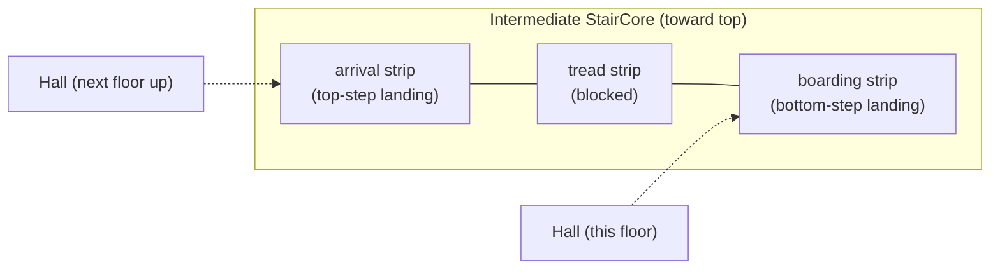

# Multi-Floor Plans: Stairs, Lifts, and Vertical Stacking

Two- and three-story buildings, multi-family residential, hotels, and
small office buildings all need multiple `floor` blocks plus
circulation that crosses them. This reference covers the conventions
for stacking floors, aligning circulation, and validating consistency.

## When to use multi-floor

Add a second `floor` block when any of these are true:

- Total program area exceeds ~1500 sqft.
- The brief explicitly says "two-story", "townhouse", "duplex",
  "hotel suite", "office building", etc.
- The brief calls for circulation elements (stair, elevator) without
  specifying which floor they connect.

For studios and 1BR apartments, keep everything on a single floor.

## File structure for multi-floor

```text
%%{version: 1.0}%%
floorplan
  config { default_unit: ft, stair_code: residential, default_height: 10ft }

  floor GroundFloor height 10ft {
    # public + circulation rooms
    # at least one stair and/or one lift
  }

  floor FirstFloor height 10ft {
    # private rooms (typically bedrooms)
    # the same stair / lift, identical (x, y) and size
  }

  # connect rooms within a floor as usual
  connect Foyer.top to outside door at 50%

  # stack circulation elements across floors
  vertical GroundFloor.MainStair to FirstFloor.MainStair
  vertical GroundFloor.MainElevator to FirstFloor.MainElevator
```

The `vertical` statements are required for the renderer and analyzer
to treat the stacked elements as a single shaft. Without them, each
floor's stair will be drawn independently.

## Floor naming conventions

Use these IDs in order:

| Floor                    | ID conventions                                              |
| ------------------------ | ----------------------------------------------------------- |
| Below ground             | `Basement`, `Cellar`, `LowerLevel`                          |
| Entry / ground           | `GroundFloor`, `MainFloor`, `LobbyFloor`                    |
| Above-ground residential | `FirstFloor`, `SecondFloor`, `ThirdFloor`, ...              |
| Top of building          | `Penthouse`, `RoofDeck`                                     |
| Roof itself              | `Roof`                                                      |

Use PascalCase. Avoid spaces or hyphens. Floors are ordered by their
declaration sequence, not by ID, so write them top-down: basement
first, then ground, then upper floors, then roof.

## Floor heights

If `height` is omitted, the floor inherits `config.default_height`
(default 9 ft). Common values:

| Floor type         | Height |
| ------------------ | ------ |
| Standard residential | 9-10 ft  |
| Commercial / retail | 12-14 ft |
| Industrial / warehouse | 16-20 ft |
| Penthouse / loft     | 12-14 ft |

Mixing heights is allowed:

```text
floor GroundFloor height 12ft { ... }   # taller lobby
floor FirstFloor height 9ft { ... }     # standard residential
```

Mismatched floor heights cause the stair `rise` field to differ across
floors. Set each stair's `rise` equal to the **floor below**'s height
(i.e. the stair from `GroundFloor` to `FirstFloor` rises by
`GroundFloor.height`).

## Stacking rules

The agent and the design critic enforce these rules. Generators
should produce them; critics warn on violations.

### 1. Footprint alignment

Each floor's bounding box should be the same width and height (or a
strict subset of the floor below's footprint, e.g. a penthouse on top
of a wider building). Misaligned footprints make the renderer's
stacked view look wrong.

To check: compare `analyze.mjs` output's `floors[].boundingBox` width
and height across floors.

### 2. Circulation alignment

Stairs, elevators, and chimneys must occupy identical `(x, y)` and
size on every floor they pass through. The grammar treats each
floor's stair declaration independently, so the agent is responsible
for keeping them in sync.

When duplicating a stair from `GroundFloor` to `FirstFloor`:

- Copy the entire `stair ...` line, including `at (x, y)`, `size`,
  `width`.
- Adjust the `rise` to match the floor it lands on.
- Add a `vertical` link.

### 2a. Stair footprint and landings

Per-floor circulation alignment (above) is necessary but not sufficient.
A staircase also needs to *fit* inside the room that contains it, and
needs clear standing room on both ends. The critic rules
`stair_through_walls`, `stair_landing_clearance`, `stair_door_collision`
and `stair_room_access` (all defined in `scripts/_critic_lib.mjs`)
enforce this. The agent is expected to size the stair-bearing room
correctly when first generating the plan; the rules are a safety net,
not a substitute for arithmetic.

**Run-length formula.** For any straight-run stair:

```
stepCount  = ceil(rise / riser)
runLength  = stepCount * tread
coreLength = runLength + 2 * landing
```

Default tread depths and landing minimums:

| Code         | Riser | Tread | Min landing |
| ------------ | ----- | ----- | ----------- |
| `residential` | 7 in  | 11 in | 3 ft        |
| `commercial`  | 7 in  | 11 in | 4 ft        |
| `ada`         | 7 in  | 11 in | 4 ft        |

Set `config.stair_code = commercial` (or `ada`) when authoring
non-residential plans; the critic uses that key to pick the landing
minimum.

**Worked example — 10 ft floor-to-floor, residential.**

```
rise       = 10 ft
riser      = 7 in   = 0.583 ft
tread      = 11 in  = 0.917 ft
stepCount  = ceil(10 / 0.583) = 18
runLength  = 18 * 0.917      = 16.5 ft
coreLength = 16.5 + 2 * 3    = 22.5 ft   (round up to 23 ft)
```

So a single straight residential stair core is **6 ft wide × 23 ft
deep**. `program_to_skeleton.mjs` derives this size from the rise of
the floor below + `config.stair_code`, places the stair element at
`(1, 3)` so the bottom landing is built into the room, and emits a
door on the stair-core's `right` wall positioned so that it lands
inside the top landing (clear of the tread strip).

**Both-end egress for straight stairs.** A straight run splits its core
into two disconnected landing strips: a *boarding* (bottom-step) strip
on the first-tread side and an *arrival* (top-step) strip on the
last-tread side. The tread itself is impassable on plan view, so a
single door at one end strands anyone using the other end. The
`stair_landing_egress` critic enforces an egress connection on the
strip(s) required by the stair's role on each floor:

| Floor role in `vertical` chain | Boarding strip needed? | Arrival strip needed? |
| ------------------------------ | ---------------------- | --------------------- |
| Origin (F0)                    | yes                    | no                    |
| Intermediate (F1 ... F(n-1))   | yes                    | yes                   |
| Terminus (Fn)                  | only if Fn climbs further | yes                |



U / L / spiral / winder cores are exempt because the *interior* landing
lets occupants cross between strips inside the core. Only `straight`
runs trigger the rule.

The auto-emitted `add_connection` op (and `program_to_skeleton.mjs`'s
own connection emitter) defaults to `opening` for `stair_code:
residential` and `door` for `commercial` / `ada` — residential cores
typically stay walk-throughs to keep the dual-landing access frictionless.

**Stair-shape fallbacks.** If the room available for the stair core is
shorter than `coreLength`, switch shapes rather than scaling the run:

| Shape       | Approx. footprint (residential, 10 ft rise) | When to use |
| ----------- | -------------------------------------------- | ----------- |
| `straight`  | 6 ft × 23 ft                                 | Default; long, narrow core. |
| `L-shaped`  | ~10 ft × 13 ft (with 4 ft landing)           | Square-ish core; one 90° turn at the landing. |
| `U-shaped`  | ~10 ft × 12 ft (two parallel runs)           | Compact square core; needed below ~9 ft tall ceilings if depth is constrained. |
| `spiral`    | 6 ft × 6 ft (≥ 5 ft outer radius)            | Last-resort fallback when no other shape fits; see local code (most jurisdictions ban spirals as primary egress). |

`stair_through_walls` runs this fallback table and includes the best
suggestion in its message; `suggest_improvements.mjs` echoes it as an
advisory.

### 2b. Roof slab cutouts above stairs and lifts

The 3D scene builder cuts a hole through the slab of the floor *above*
every `stair` and `lift`, so occupants have somewhere to physically
arrive when they step off the top tread or out of the cab. **You do not
write these cutouts in the DSL** — they are derived automatically from
the bounding box of each circulation element on the floor below.

Two consequences for the author:

1. **The cutout is geometric, not declared.** It is independent of
   `vertical` links. A `vertical` declaration tells the analyzer (and the
   editor's selection sync) that two elements form one shaft; the slab
   penetration is computed separately by `floorplan-3d-core` from the
   stair/lift's `Box3` bounding box.
2. **For a stair to have a visible exit, the next floor must exist as a
   `floor` block.** A stair on the topmost declared floor has nothing to
   punch through — it terminates in mid-air. The fix is to declare an
   explicit roof slab as its own `floor Roof` block.

#### Pattern: declare a `floor Roof` for top-floor stair exits

The canonical pattern is in `examples/StairsAndLifts.floorplan`:

```text
floor Penthouse height 12ft {
  room GrandFoyer at (0, 0) size (36 x 25) walls [...] label "Grand Foyer"
  stair SpiralStair  at (5, 5)   shape spiral ... rise 12ft ...
  stair CustomStair  at (15, 10) shape custom ... rise 12ft ...
  lift  GlassElevator at (30, 2) size (5ft x 5ft) doors (bottom, left)
}

floor Roof {
  room RoofSlab at (0, 0) size (36 x 25) height 3ft
       walls [top: solid, right: solid, bottom: solid, left: solid]
       label "Roof" style Outdoor
}
```

Rules for the `floor Roof` block:

- **Cover every top-floor stair / lift footprint.** The Roof room's
  `at (x, y)` + `size` rectangle must contain the union of every
  top-floor stair and lift bounding box. The simplest robust choice is
  to match the floor below's perimeter; otherwise expand the room until
  every penetration sits inside it.
- **Use `solid` walls with `height 3ft` for a parapet.** Solid walls
  render as parapet walls. You **must** set an explicit `height` (3–4 ft
  is typical) — without it the room inherits the full floor height and
  the parapet renders as a full-story wall. Use `height 3ft` for a
  standard parapet or `height 4ft` for a taller one.
- **Use `open` walls only for a completely unenclosed deck** where no
  visual cap is desired (rare; most rooftops benefit from at least a
  code-minimum parapet).
- **No circulation on the Roof.** A roof slab terminates the `vertical`
  chain; don't add a stair on the Roof itself unless the brief calls for
  a roof-deck-to-attic stair.
- **No `vertical` link to the Roof is needed.** `vertical` only chains
  stair/lift elements, and the Roof has none.

A multi-stair top floor (like StairsAndLifts' Penthouse) reuses a
single Roof room to cover all three penetrations (`SpiralStair`,
`CustomStair`, `GlassElevator`) — the room footprint is the union, not
one room per cutout.

#### Without a `floor Roof`

If the topmost stair has no floor above:

- The plan still validates and renders.
- In the 3D viewer the stair geometry's last tread sits at the would-be
  walking surface (~25 mm below where the slab top would be), but
  with no slab there is no visible exit, no parapet, and no roof
  walking surface. Visually the stair "ends in mid-air".
- The analyzer's reachability and `multi_floor_egress` rules are
  unaffected.

This is acceptable when the brief deliberately leaves the rooftop
out-of-scope (e.g. you only model habitable floors). Add a `floor Roof`
when the rooftop is part of the program — terraces, roof gardens,
mechanical penthouses, or any case where you need the stair's exit to
read correctly in 3D.

#### Verifying the cutout

The bundled [`render_3d.mjs`](../scripts/render_3d.mjs) is a static
axonometric stacker — it does **not** apply CSG cutouts, so the roof
slab will look solid even when the cutouts are correctly generated by
the full pipeline. Use the floorplan-viewer (`make viewer-dev` from the
monorepo root, or drag-and-drop the DSL onto a running viewer) to
confirm the holes. A quick sanity check: toggle the Roof floor's
visibility off in the Floors panel — the top-floor stair tops and lift
tops should sit just below the would-be slab top, clearly poking up
through what was the cutout.

### 3. Wet-wall alignment (plumbing chase)

Stack bathrooms, kitchens, and laundries vertically so plumbing risers
share a wet wall. Same rule: identical `(x, y)` of the wet room (or
a small subset) on every floor.

### 4. Bedroom-bath proximity per floor

Each habitable floor (one with bedrooms) needs at least one bathroom
on the same floor. Don't make residents go down to use the bathroom.

### 5. Egress

A multi-floor residential plan needs at least one stair reaching
ground level. Commercial plans need at least two egress paths from
each floor (in addition to elevators). Encode this by ensuring at
least two `stair` elements on commercial floors and two `connect ...
to outside door` statements on the ground floor.

## Stair sizing per floor type

Use these defaults when generating a multi-floor plan from a brief.
Match the `config { stair_code: ... }` setting.

| Setting        | Width | Riser | Tread | Headroom |
| -------------- | ----- | ----- | ----- | -------- |
| `residential`  | 36 in | 7.75 in | 10 in | 80 in    |
| `commercial`   | 44 in | 7 in   | 11 in | 80 in    |
| `ada`          | 44 in | 7 in   | 11 in | 80 in    |
| `none`         | -     | -     | -     | -        |

Stair runs (number of treads):

- Residential single-flight: 13-15 risers per flight (10 ft floor at
  7.75 in riser ≈ 16 risers; pick a 15-riser flight + 1 step at the
  landing).
- Commercial / ADA: max 12 risers per flight, then a landing of at
  least 4 ft × 4 ft (5 ft × 5 ft preferred for ADA).

## Lift sizing

| Use                       | Size           | Doors                |
| ------------------------- | -------------- | -------------------- |
| Residential 2-3 floors    | 4 ft × 4 ft   | `doors (bottom)`     |
| Apartment building        | 5 ft × 7 ft   | `doors (bottom)`     |
| ADA passenger             | 5 ft × 7 ft   | `doors (bottom)`     |
| Commercial / hotel        | 6 ft × 8 ft   | `doors (bottom, top)` for through-cars |
| Service / freight         | 7 ft × 9 ft   | `doors (bottom)`     |

## Composing a multi-floor plan from scratch

Recommended generation order:

1. Sketch the ground floor first (entry, public zone, one bath, a
   stair core).
2. Place the stair / lift core at a corner or along a structural
   axis.
3. Copy the stair core to subsequent floors before placing rooms.
4. Place private rooms on upper floors, mirroring the ground-floor
   wet wall location.
5. Add `vertical` links for all circulation.
6. Run `validate.mjs` on each floor and `design_critic.mjs` on the
   whole file.

## Generating a multi-floor skeleton

`scripts/program_to_skeleton.mjs` accepts a `--floors N` flag that
partitions the brief's rooms across N floors and auto-stacks a
`StairCore` room (5 × 14 ft, walls solid on every side) plus a
`MainStair` element pinned at `(1, 1)` on each floor. It also emits the
required `vertical GroundFloor.MainStair to FirstFloor.MainStair ...`
line so the rendered output validates without manual stair stacking.

```bash
node scripts/program_to_skeleton.mjs \
  --brief brief.json \
  --floors 2 \
  --out plan.floorplan
```

Conventions the generator picks for you:

- `bedroom`, `master`, `bath`, `wic` rooms default to the **upper**
  floor. `entry`, `living`, `kitchen`, `dining`, `powder`, `garage`
  default to the **ground** floor. Override per-room by adding a
  `"floor": "GroundFloor"` (or `"FirstFloor"`) field on the room in
  the brief.
- `default_height` is emitted as a plain number (e.g.
  `default_height: 10`) — the grammar rejects unit suffixes here.
- Each floor gets a uniquely named `StairCore` room
  (`GroundFloorStairCore`, `FirstFloorStairCore`) so connection
  positions don't alias across floors. The `stair` element keeps the
  shared name `MainStair` so the `vertical` link binds correctly.
- The generator only emits exterior + stair-core circulation; you are
  expected to add room-to-room doors on each floor before the plan
  passes the critic's reachability check.

## 3D feedback loop

Use `scripts/render_3d.mjs` to produce an axonometric SVG/PNG you can
inspect without launching the full Three.js floorplan-viewer. This is
intended for "is the layout sensible in 3D?" feedback during the
design loop — not as a replacement for the interactive viewer when
materials, lighting, or GLB export matter.

```bash
node scripts/render_3d.mjs plan.floorplan \
  --out plan-3d.png \
  --angle iso          # or `cabinet` for a flatter projection
  --width 1200
```

What you see in the rendered image:

- Each room as an extruded box with the roof slab on top, the front
  (`bottom` direction) wall, and the right wall. Walls are colour-
  coded by type: solid (taupe), window (light blue), open (warm
  cream).
- Floor slabs as thin strips below each floor's room footprint, so
  cantilevers and footprint mismatches are obvious.
- Stairs as a sloped run of treads pointing in the declared direction.
- Lifts as solid extruded shafts.

Feed the resulting PNG back into the agent loop (e.g. attach to the
review step) so a vision model can call out 3D issues like cantilevers,
unaligned shafts, or rooms that look impossibly tall for their floor
height. For full Three.js / GLB exports, drag-and-drop the
`.floorplan` into `floorplan-viewer` instead.

## Validation tips

- `analyze.mjs` reports per-floor metrics; the multi-floor critic
  rules (`footprint_aligned`, `stair_vertical_aligned`,
  `multi_floor_egress`) consume the same floor data so you rarely
  need to compare bounding boxes by hand any more.
- `design_critic.mjs` now flags misaligned vertical shafts:
  - `footprint_aligned` — upper floor's bounding box must fit inside
    the ground floor's (cantilevers > 1 ft are warned).
  - `stair_vertical_aligned` — stairs/lifts on multiple floors must
    be paired with a `vertical` link, and the linked elements must
    share `(x, y)` and width within 0.5 ft.
  - `multi_floor_egress` — every habitable upper floor must reach
    the ground floor through a `vertical`-linked stair or lift.
  - `validator_3d` — surfaces the Langium 3D-rendering warnings
    (mismatched shared walls, room taller than floor, etc.) as
    `info`-level critic findings so they show up in the same loop.
- `mcp_parity_check.mjs` will exercise both the bundled scripts and
  the MCP server on multi-floor inputs; use it to spot drift in
  vertical-link handling.

## Common pitfalls

- **Forgetting `vertical` links.** The stair will render but the
  analyzer won't connect floors. Always add the `vertical` line.
- **Penthouses without a parent floor.** A `penthouse` declared
  before any floors above ground floor will be ordered incorrectly.
- **Stair `rise` smaller than floor `height`.** Stair won't reach the
  next floor. The rise must equal or exceed the floor's height.
- **Multiple stairs at the same `(x, y)`.** Confuses the renderer's
  stacked view. Either use a single stair per shaft, or move them
  apart.
- **Top-floor stair with no floor above.** The slab cutout for an
  exit hole is derived from the *next* floor's slab. Without a
  `floor Roof` (or other `floor` block) above the topmost stair, the
  stair geometry has nothing to punch through and reads as "ends in
  mid-air" in the 3D viewer. See §2b "Roof slab cutouts above stairs
  and lifts" for the canonical pattern.
